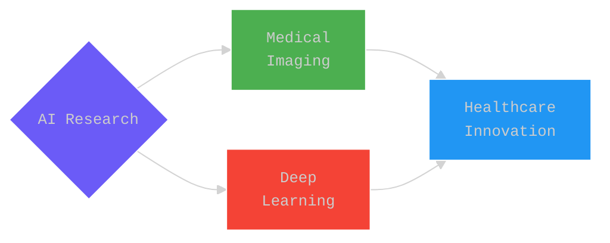

# Aydin Ayanzadeh, Ph.D. Candidate

<div align="center">

[](https://git.io/typing-svg)

<a href="https://www.linkedin.com/in/ayanzadeh93/"></a>
<a href="https://twitter.com/aydin_ayanzadeh"></a>
<a href="https://www.instagram.com/aydin_ayanzadeh/"></a>
<a href="https://www.ayanzadeh.com/"></a>
<a href="mailto:a.ayanzadeh@gmail.com"></a>


</div>

##  Research Vision

```typescript
interface ResearchProfile {
  role: string;
  mission: string;
  impact: string[];
}

const profile: ResearchProfile = {
  role: "AI Research Scientist @ UMBC",
  mission: "Transforming Healthcare through AI Innovation",
  impact: [
    "🧠 Pioneering Medical Image Analysis",
    "🔬 Advancing Deep Learning Architectures",
    "💡 Bridging AI Theory and Clinical Practice",
    "🌟 Innovating Healthcare Solutions"
  ]
};
```

##  Innovation Pipeline

<div align="center">



<table>
<tr>
<td align="center">

<br/>Novel Deep Learning<br/>Architectures
</td>
<td align="center">

<br/>Real-time Medical<br/>Systems
</td>
<td align="center">

<br/>Clinical AI<br/>Integration
</td>
<td align="center">

<br/>Mobile Health<br/>Solutions
</td>
</tr>
</table>

</div>

##  Tech Stack

<div align="center">


<table>
<tr>
<td>
  
### 🧠 AI/ML


  
</td>
<td>
  
### 🛠️ Tools


  
</td>
</tr>
</table>

</div>

##  GitHub Analytics

<div align="center">


</div>

##  Connect

<div align="center">

[](mailto:a.ayanzadeh@gmail.com)
[](https://www.ayanzadeh.com/)
[](https://www.google.com/maps/place/Baltimore,+MD)

</div>

<div align="center">

</div>
