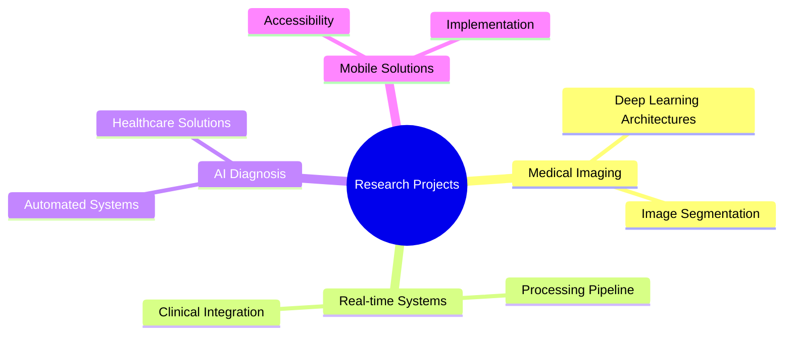

# Aydin Ayanzadeh, Ph.D. Candidate

<div align="center">

[](https://git.io/typing-svg)

<a href="https://www.linkedin.com/in/ayanzadeh93/"></a>
<a href="https://twitter.com/aydin_ayanzadeh"></a>
<a href="https://www.instagram.com/aydin_ayanzadeh/"></a>
<a href="https://www.ayanzadeh.com/"></a>
<a href="mailto:a.ayanzadeh@gmail.com"></a>


</div>

## 🎓 Professional Summary

<div align="left">

> Graduate Teaching Assistant and Researcher at the University of Maryland Baltimore County (UMBC), specializing in the intersection of Computer Vision, Deep Learning, and Medical Imaging. Committed to advancing healthcare through innovative AI solutions.

```python
class ResearchHighlights:
    def __init__(self):
        self.role = "Ph.D. Student in Computer Science @ UMBC"
        self.research = "Published researcher in medical imaging and deep learning"
        self.expertise = "Expert in developing AI-powered medical imaging solutions"
        self.focus = "Bridging theoretical AI and practical healthcare applications"
        
    def get_highlights(self):
        return [
            f"📚 {self.role}",
            f"🏆 {self.research}",
            f"💻 {self.expertise}",
            f"🎯 {self.focus}"
        ]
```

</div>


## 🔬 Research & Expertise

<table align="center">
<tr>
<td align="center">

<br>Deep Learning
</td>
<td align="center">

<br>Computer Vision
</td>
<td align="center">

<br>Medical Imaging
</td>
<td align="center">

<br>Machine Learning
</td>
</tr>
</table>

### Core Research Areas
- 🧠 Deep Learning Architecture Design & Optimization
- 👁️ Computer Vision & Image Processing Systems
- 🏥 Medical Image Analysis & Healthcare AI
- 📊 Machine Learning in Biomedical Applications

### Current Projects



## 💻 Technical Proficiency

<details open>
<summary><b>Programming Languages</b></summary>


</details>

<details open>
<summary><b>AI/ML Frameworks</b></summary>


</details>

<details open>
<summary><b>Development Tools</b></summary>


</details>


## 📈 GitHub Statistics

<div align="center">

[](https://github.com/ryo-ma/github-profile-trophy)


</div>


## 🤝 Let's Connect

- 💼 Open for research collaborations in medical imaging and AI
- 📚 Interested in mentoring and teaching opportunities
- 🔍 Looking to connect with fellow researchers and professionals

### 📬 Contact Information
<div align="center">

[](mailto:a.ayanzadeh@gmail.com)
[](https://www.ayanzadeh.com/)
[](https://www.google.com/maps/place/Baltimore,+MD)

</div>

---

<div align="center">


*"Advancing healthcare through innovative AI solutions"*

</div>
