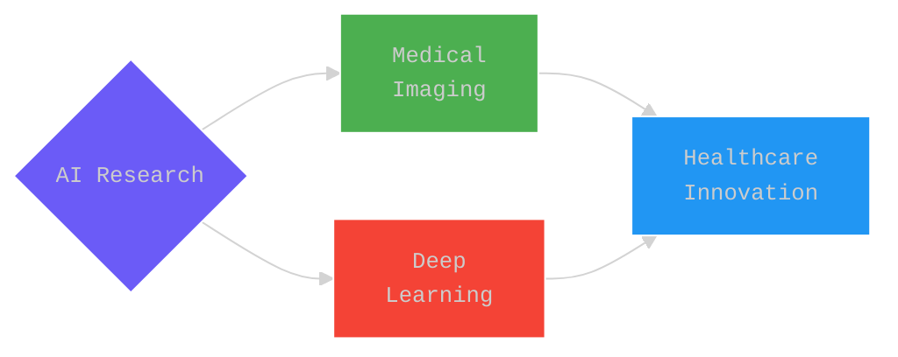

# Aydin Ayanzadeh, Ph.D. Candidate

##  Research Vision

<table>
<tr>
<td align="center">

 
<b>Advanced Computing</b>
 
Machine Learning & Computer Vision
</td>
<td align="center">

 
<b>Systems Architecture</b>
 
Optimization & Performance
</td>
<td align="center">

 
<b>Innovation Focus</b>
 
Next-Gen AI Solutions
</td>
</tr>
</table>

 

  

##  Research Focus

<table border="0">
<tr>
<td align="center">

 
<b>System Architecture</b>
 
• Neural Networks 
• Performance Optimization
</td>
<td align="center">

 
<b>Deep Learning</b>
 
• Advanced Algorithms 
• Model Architecture
</td>
<td align="center">

 
<b>Data Systems</b>
 
• Pattern Recognition 
• Real-time Processing
</td>
<td align="center">

 
<b>Edge Computing</b>
 
• Mobile Solutions 
• System Integration
</td>
</tr>
</table>

##  Innovation Pipeline

<table>
<tr>
<td align="center">

 Novel Deep Learning Architectures
</td>
<td align="center">

 Real-time Medical Systems
</td>
<td align="center">

 Clinical AI Integration
</td>
<td align="center">

 Mobile Health Solutions
</td>
</tr>
</table>

##  Tech Stack

<table>
<tr>
<td>
  
### 🧠 AI/ML

  
</td>
<td>
  
### 🛠️ Tools

  
</td>
</tr>
</table>

##  GitHub Analytics

  

  
  

<b>📊 Detailed Statistics</b>

 

| Category | Statistics |
|:--------:|:----------:|
| 🌟 Stars Earned |  |
| 📦 Repositories |  |
| 💻 Lines of Code |  |
| 📝 Language Distribution |  |

##  Connect

