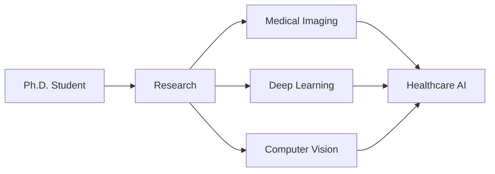

# Aydin Ayanzadeh, Ph.D. Candidate

<div align="center">
  
  
  
  <br/>
  
  <a href="https://www.linkedin.com/in/ayanzadeh93/">
    
  </a>
  <a href="https://twitter.com/aydin_ayanzadeh">
    
  </a>
  <a href="https://www.instagram.com/aydin_ayanzadeh/">
    
  </a>
  <a href="https://www.ayanzadeh.com/">
    
  </a>
  <a href="mailto:a.ayanzadeh@gmail.com">
    
  </a>
  
</div>

<div align="center">
  
  ```text
  🎓 Graduate Teaching Assistant & Researcher @ UMBC
  🔬 Specializing in Computer Vision, Deep Learning, & Medical Imaging
  🌟 Advancing Healthcare through Innovative AI Solutions
  ```
  
</div>

---

<details open>
<summary><h2>🎯 Professional Journey</h2></summary>



### Current Focus Areas
<div align="center">
  <table>
    <tr>
      <td align="center">
        <br>
        Architecture Design & Optimization
      </td>
      <td align="center">
        <br>
        Image Processing Systems
      </td>
    </tr>
    <tr>
      <td align="center">
        <br>
        Healthcare AI Applications
      </td>
      <td align="center">
        <br>
        Biomedical Applications
      </td>
    </tr>
  </table>
</div>
</details>

<details open>
<summary><h2>💻 Technical Arsenal</h2></summary>

<div align="center">

### Programming Languages
<p>
  
  
  
  
</p>

### AI/ML Frameworks
<p>
  
  
  
  
</p>

### Development Tools
<p>
  
  
  
  
</p>

</div>
</details>

<details open>
<summary><h2>📊 GitHub Analytics</h2></summary>

<div align="center">
  
  
  
  
  
</div>
</details>

<details open>
<summary><h2>🌟 Current Projects</h2></summary>

<div align="center">
  <table>
    <tr>
      <td align="center">
        
        <br/>
        Novel deep learning architectures
      </td>
      <td align="center">
        
        <br/>
        Medical imaging systems
      </td>
    </tr>
    <tr>
      <td align="center">
        
        <br/>
        AI-powered diagnostic tools
      </td>
      <td align="center">
        
        <br/>
        Healthcare accessibility
      </td>
    </tr>
  </table>
</div>
</details>

<details open>
<summary><h2>🤝 Connect & Collaborate</h2></summary>

<div align="center">
  <table>
    <tr>
      <td>
        <a href="mailto:a.ayanzadeh@gmail.com">
          
        </a>
      </td>
      <td>
        <a href="https://www.ayanzadeh.com/">
          
        </a>
      </td>
      <td>
        
      </td>
    </tr>
  </table>

  ### Open for:
  - 🔬 Research collaborations in medical imaging & AI
  - 📚 Mentoring & teaching opportunities
  - 🤝 Professional networking
</div>
</details>

---

<div align="center">
  
</div>
