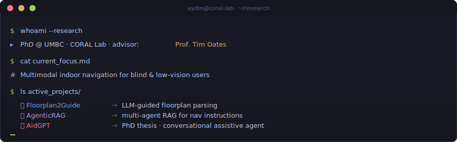
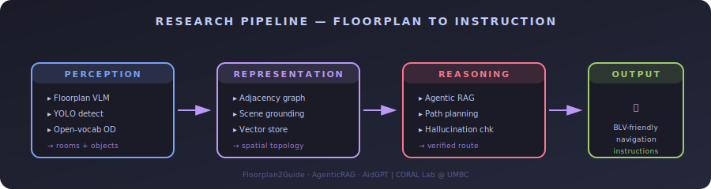

<!--
═══════════════════════════════════════════════════════════════════════════════
  Aydin Ayanzadeh — GitHub Profile
  PhD · Computer Science · UMBC · CORAL Lab
  Theme: Tokyo Night  ·  Custom SVG widgets in ./assets/
═══════════════════════════════════════════════════════════════════════════════
-->

<!-- ─── HEADER WAVE ────────────────────────────────────────────────────────── -->

<!-- ─── TYPING SVG (URL-safe encoding) ─────────────────────────────────────── -->

  

<!-- ─── SOCIAL BADGES ──────────────────────────────────────────────────────── -->

  
  
  
  
  
  

---

<!-- ─── TERMINAL CARD (custom, hosted in this repo — never breaks) ─────────── -->

  

---

### 🔬 Research Pipeline

<!-- ─── CUSTOM PIPELINE DIAGRAM (custom SVG, hand-designed for your work) ──── -->

  

> The pipeline above is the architecture I work on day-to-day. **Perception** extracts rooms and objects from raw floor plans using VLMs and YOLO-based detectors. **Representation** turns that into a navigable spatial graph plus a retrieval store. **Reasoning** uses agentic RAG to plan paths and verify them against hallucinations. The output is a natural-language route a blind or low-vision user can actually follow.

---

### 🚀 Active Projects

<table>
<tr>
<td width="50%" valign="top">

#### 🗺️ Floorplan2Guide
LLM-guided agentic floor plan parsing for indoor BLV navigation.
- **Venue:** CVPR Workshop 2025
- **Stack:** `Python` `VLMs` `NetworkX` `LangChain`
- **Key idea:** decompose floorplan understanding into agent sub-tasks (rooms, doors, adjacency) for grounded path queries.

</td>
<td width="50%" valign="top">

#### 🤖 AgenticRAG
Multi-agent RAG pipeline for accessible navigation instructions.
- **Status:** Active research
- **Stack:** `LangGraph` `RAG` `Multi-agent` `Qwen2-VL`
- **Key idea:** specialist agents (planner, verifier, instructor) coordinate to suppress LLM hallucination in safety-critical routing.

</td>
</tr>
<tr>
<td width="50%" valign="top">

#### 💬 AidGPT
PhD thesis — conversational assistive agent for BLV users.
- **Status:** In development
- **Stack:** `PyTorch` `Multimodal LLMs` `Speech`
- **Key idea:** real-time multimodal dialogue grounded in physical environment context.

</td>
<td width="50%" valign="top">

#### 🔭 InVLM
LoRA fine-tuning of Qwen2-VL for indoor scene understanding.
- **Status:** Ongoing
- **Stack:** `PEFT` `Qwen2-VL` `🤗 Transformers`
- **Key idea:** parameter-efficient adaptation of VLMs to indoor floor-plan / navigation domains.

</td>
</tr>
</table>

---

### 🛠 Tech Stack

  

  
  
  
  
  
  
  
  

---

### 📄 Selected Publications

<table>
<tr>
<td>📍</td>
<td>

**LLM-Guided Agentic Floor Plan Parsing for Accessible Indoor Navigation of Blind and Low-Vision Users**  
*A. Ayanzadeh, T. Oates et al.* — **CVPR Workshop 2025**

</td>
</tr>
<tr>
<td>🔥</td>
<td>

**Multimodal Wildfire Risk Assessment via YOLO Detection and LLM Reasoning**  
*A. Ayanzadeh et al.* — **2025**

</td>
</tr>
<tr>
<td>🕸️</td>
<td>

**Adjacency-Graph Representations for Indoor Navigation in Vision-Language Models**  
*Under review* — **2026**

</td>
</tr>
</table>

📚 Full list → [Google Scholar](https://scholar.google.com/) · [Portfolio](https://www.ayanzadeh.com/)

---

### 📊 GitHub Analytics

  
  

  

  

<b>📈 Contribution Activity Graph</b>

 

  

<b>🐍 Contribution Snake</b> (animated · daily)

 

  

Setup: see <code>.github/workflows/snake.yml</code> in this repo.

<b>🏙 3D Contribution Skyline</b> (auto-generated · daily)

 

  

Setup: see <code>.github/workflows/3d-contrib.yml</code>.

---

### 🤝 Collaboration

I'm open to:
- 🔬 Research collaborations in **assistive AI · multimodal LLMs · agentic systems · spatial reasoning**
- 🏢 Industry **research internships** (VLM, agents, accessibility)
- 🎓 Mentoring students entering ML / CV research
- 📝 Peer review for ML / CV / accessibility venues

📬 **a.ayanzadeh@gmail.com** &nbsp;·&nbsp; 📍 Baltimore, MD 

---

<i>"Building AI that sees, so others can navigate."</i>

